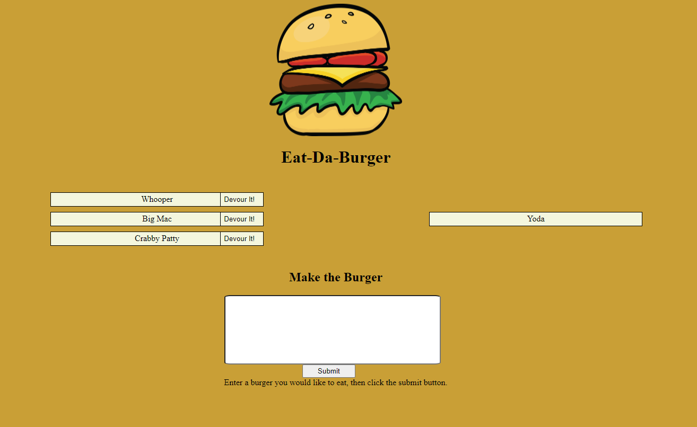

# Node Express Handlebars (Eat-Da-Burger)

## Table of Contents
1. [ Description ](#desc)
2. [ Installation ](#install)
3. [ Usage ](#usage)
4. [ License ](#lic)
5. [ Questions ](#quest)
    

## 1. Description
This page is fantastic use of Node, Express, and Handlebars. Combinds all the basics needed to recieve data, display it and change it. Remove was specificilly not used in this app.
    

## 2. Installation
Make sure to have the package.json file in the folder then type "npm install" in your terminal. The neccessary files will install automatically.
server.js file must be ran using node.js or nodemon
Within the config>db.config.js file. enter your MySQL Workbench connection information. Create the schema providedin the db folder.
    

## 3. Usage
Enter any burger name you want to put it on the queue list. When you are ready to devour the burger, sipmply click the "Devour It!" button, sending it over the the easten side.
 
<h3>Eat-Da-Burger</h3>

 

    

## 4. License
ISC
    

## 5. Questions
Please visit my GitHub to view all of my work:
https://www.github.com/bbrintle 

Check out the site:
https://limitless-brook-28499.herokuapp.com/

Contact me at: bbrintle@gmail.com